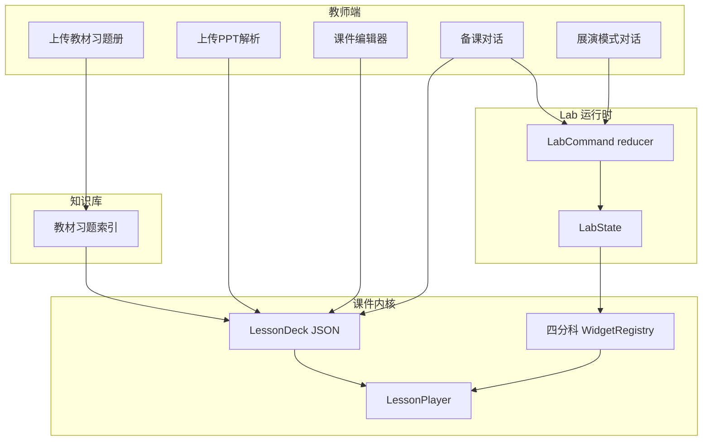
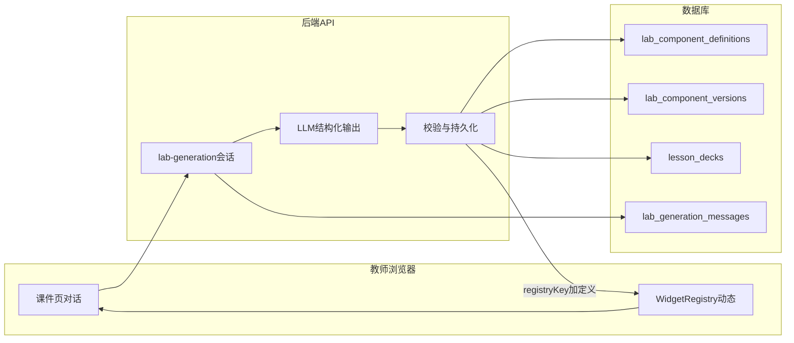

# 教师端互动课件与理科 Lab 设计（专项）

本文件**以教师端互动与 Lab 设计为主**；与「发布」「学生消费」衔接处明确下列**硬约束**（产品 + API）：

- **学生端**：**仅可阅读教师已发布的课件**（含由 **上传 PPT 解析** 得到的 deck）；**不可见** 草稿、**不可** 编辑、**不可** 调用「生成新 Lab」或 `lab-generation` 相关接口。
- **教师端**：**唯一** 具备「生成新 Lab 定义」能力；该操作 **必须** 经 **弹窗确认** 后再发起请求（防误触与课堂误操作）。

---

## 1. 教师端目标与范围

- **产出物**：面向小初高课堂的 **Web 互动课件**（平台原生幻灯片 JSON + 内嵌 Lab）。**导出 `.pptx` 可为辅**，与「上传既有 PPT」互为补充。
- **内容来源（双轨）**：  
  - **轨 A — 知识库驱动**：教材、讲义、习题册、题库等进入 **知识库** 后，支持 **AI 一键生成** 整课或章节课件（大纲→分镜→块），须带 **citations** 可追溯。  
  - **轨 B — 上传既有 PPT**：教师上传 `.pptx`（及兼容格式），平台 **解析** 为内部 slide 列表（每页文本、备注、版式占位、缩略图）；后续在编辑器中 **按需插入 Lab**，而非整课强制重写。
- **实验场景两条路径（均以 AI 为必要能力）**：  
  - **路径 ① — AI 一键生成**：单次调用（或可配置「一键套件」）由模型输出完整或高完成度的 `widgetType` + `initialState`（+ 可选命令草案），属 **批量/少交互** 形态。  
  - **路径 ② — 教师—模型对话逐步生成**：多轮对话，由模型逐轮产出 **diff / 命令**，教师确认后合并，属 **迭代/高可控** 形态。  
  **二者均需后端 LLM（及配套工具调用/结构化输出）**；差异仅在 **产品交互与调用编排**，不是「一条用 AI、一条不用 AI」。教师仍可 **在 AI 结果上做手工微调**（改参数、改连线），但 **主线供给来自模型**。运维上可对 **模型路由、配额、校务审核** 做策略配置，但不把「关闭 AI」作为默认产品假设。
- **理科呈现**：**数学 / 物理 / 化学 / 生物** 四类 **独立 Lab 组件族**（命名空间、目录、注册表均分离），每类下多 **widget（教学微场景）**。
- **交互深度**：每个 Lab 实例具备 **完整动态交互逻辑**（含 **二维** 与 **三维** 层次：参数驱动、拖拽、动画、相机、剖切等按场景选配）。
- **对话驱动**：**展演与备课对话**均由 **模型** 将自然语言解析为 **LabCommand / statePatch**（辅以规则与安全校验），控制 Lab 变化（如电路 **加元件、开合开关** 等）；指令经 **结构化协议** 落地，保证可审计与可回放。
- **习题精细化**：同一道习题可对应 **多步拆解幻灯片**，每步绑定 **Lab 状态或过渡动画**，实现 **动态分析**（受力、变式、等效电路、离子流向等），而非仅静态图文。

---

## 2. 信息架构（教师侧）

- **课程详情** 内：**知识库资料**（教材/习题册/题库）+ **课件资产**（平台生成稿 / 上传 PPT 稿）→ **互动课件列表**（草稿/已发布）→ **课件编辑器** → **预览**（与学生端同一播放器内核）。
- **轨 A 生成流程**：勾选知识库范围 → 学段/章节/题型偏好 → **AI 一键** 生成 deck → 教师改序、改文案、换 Lab → 发布。
- **轨 B（上传 PPT）流程**：上传文件 → **解析与对齐**（页码映射、可选 OCR/版式修复）→ 进入 **PPT 增强编辑器** → 教师在 **指定页** 插入 **「Lab」入口**（按钮或热区）→ 配置进入哪个 `widgetType` / `labInstanceId` / 初始场景 → 保存为可发布 deck（底层仍为统一 JSON，便于播放器与展演模式消费）。

### 2.1 上传 PPT 后的 Lab 入口（编辑态）

- **插入方式**：按页选择「在此页添加 Lab 按钮」；支持 **按钮文案**、**图标**、**出现时机**（始终显示 / 讲者点击展开）。
- **数据**：在对应 `slide` 上增加 `labEntry` 元数据：`{ label, targetLabInstanceId?, widgetType?, initialState?, presentationMode?: "fullscreen" | "split" }`。
- **兼容**：无 Lab 入口的页保持 **静态放映** 行为；有入口的页在课堂/复习中可 **从当前页跳入 Lab** 而不丢失返回页码。

### 2.2 展演模式（课堂/演示运行态）

- **触发**：学生或教师端播放至含 `labEntry` 的幻灯片，点击 **进入 Lab** → 进入 **展演模式**（建议默认 **全屏或沉浸式分栏**：左侧/主体为 Lab 视窗，右侧或底部为 **对话与日志**）。
- **展演内 AI 对话（与「新 Lab 生成」区分）**：  
  - **驱动已有实验**：教师或授权角色输入自然语言；模型 **流式** 返回 **解释文本** + **结构化增量**（`LabCommand[]` 或 `statePatch`），作用于 **已绑定** 的 `labInstance`。  
  - **生成全新 Lab 定义**：**仅教师端** 提供入口；点击「通过对话生成新 Lab」等操作前 **必须先经弹窗确认**（说明将写入草稿/占用配额等），确认后才创建 `lab-generation` 会话并发送消息。**学生端不提供** 该入口，且后端 **拒绝** 非教师角色调用 `POST .../lab-generation/...`。  
  - **运行时** 将合法增量送入 **同一 `labInstance` 的 reducer**，**实时** 更新 **实验阶段、电路拓扑、曲线、3D 姿态** 等，实现「边讲边动」。  
  - **流式 UI**：对话区打字机效果与 Lab 区 **帧同步**（避免状态先到、文案后到造成误解）；关键步骤可配置 **执行前确认**。
- **与一键生成的关系**：展演对话侧重 **课堂生成式推进**；备课阶段可用 **一键** 或 **对话逐步** 预置「典型对话脚本」或 **初始若干步**，展演时仍允许偏离脚本即兴对话。

---

## 2.3 实验库 / 场景内容的 AI 共建（一键 + 对话逐步）

两条路径 **共享同一 AI 能力栈**（模型 API、工具模式、JSON Schema / function calling、知识库 RAG 可选上下文）；区别是 **单次大粒度生成** vs **多轮小步迭代**。

- **一键生成（路径 ①）**：教师选 **学科 + 教学意图**（如「串联电路测电阻」）+ 可选知识库片段 → **模型** 输出 **推荐 `widgetType` + `initialState` + 可选步骤脚本（commandLog 草案）** → 教师 **预览** 后 **插入** 到当前幻灯片或实验库条目。
- **对话逐步生成（路径 ②）**：教师与 **模型** **多轮** 细化（「再加一个电压表」「改成并联」）；每轮 **模型** 给出 **diff 预览**（JSON Patch 或命令列表），教师 **确认/拒绝** 后合并入场景；最终 **固化** 为 slide 块或 **可复用实验库模板**（校本沉淀）。
- **实验库定位**：可选 **校级/个人模板库**，条目含 `widgetType`、`defaultState`、`tags`、来源 citation；**非必须**独立 SKU——亦可全部内嵌在 deck 内，由学校策略决定。

---

## 3. 课件数据契约（教师端扩展）

在原有 `LessonDeck` / `Slide` / `Block` 之上增加教师端专用约定（与 Mock 并存演进）：

- `deckSource`：`kb_ai`（知识库一键生成）| `ppt_import`（上传 PPT 解析）| `hybrid`（先生成再导入或反之合并）；用于编辑器差异化能力（如 PPT 页保留原背景图）。
- `subjectLab`：`math` | `physics` | `chemistry` | `biology` — 标识当前块所属 **Lab 学科命名空间**（与文科块区分）。
- `labInstanceId`：同一幻灯片或跨页复用同一实验台时，用实例 id **共享状态**（例如多页连续讲同一电路）。
- `interactive` 块扩展：
  - `widgetType`：建议前缀区分学科，如 `math.*` / `physics.*` / `chem.*` / `bio.*`（或 `mathLab.*` 分层键名，实施时二选一保持统一）。
  - `initialState`：Lab 可序列化初始状态（JSON）；建议标记 `authoredBy: "ai_one_shot" | "ai_dialogue"` 以区分两条 AI 路径；**手工覆盖** 可记为 `manual_edit`（在 AI 稿上局部改，仍保留生成溯源）。
  - `allowedCommands`（可选）：本页允许的指令白名单；**展演模式**下可放宽，**考试/复习锁模式**下收紧。
- `labEntry`（幻灯片级，与上传 PPT 强相关）：可选字段，描述该页 **进入展演的入口**（见 §2.1）。
- `exerciseRef`（习题锚点）：`{ sourceId, page?, number?, rawSnippet? }` 指向上传资源中的题目；**拆解步骤** 用 `steps[]` 描述，每步可含 `labInstanceId` + `targetState` 或 `transition`。

**习题拆解幻灯片（类型建议）**：`block.type === 'exercise_walkthrough'` 时，`steps` 内每一步可嵌入 `interactive` 或引用已有 `labInstanceId`，实现「讲一步、动一步」。

---

## 4. 四分科 Lab 组件划分

四类 **平级** Lab 家族，各自 **独立目录与注册表**，再汇总到总 `WidgetRegistry`（按 `subjectLab` 分派）。下列为 **组件族 + 典型 widget + 二维/三维与动态逻辑要点**（实施时以「可演示闭环」为优先级迭代）。

### 4.1 数学 Lab（mathLab）

| 组件方向    | 二维交互逻辑                       | 三维交互逻辑                        |
| ------- | ---------------------------- | ----------------------------- |
| 函数与图像   | 参数滑块、轨迹、切线/割线、多曲线对比；缩放平移视口   | 可选：曲面 z=f(x,y) 网格、法线与切平面、截面动画 |
| 平面几何    | 拖拽顶点、约束（垂直/平行）、度量实时标注、动态分割面积 | 少：以 2D 为主                     |
| 立体几何    | 展开图与表面积/体积联动示意               | 柱锥台球 **旋转剖切**、展开动画、多视角 Orbit  |
| 解析几何    | 直线/圆/圆锥曲线参数与方程联动、距离与夹角       | 坐标系三轴示意（弱 3D）                 |
| 数列与概率统计 | 条形/折线/散点、递推可视化、直方图与分布曲线      | 可选：简单 3D 散点                   |

**动态逻辑共性**：统一 **参数 schema**（如 `ParameterDef[]`）、**动画时间轴**（可选 keyframes）、**约束求解**（简单几何用前端约束，复杂可降级为预设）。

### 4.2 物理 Lab（physicsLab）

| 组件方向  | 二维交互逻辑                                       | 三维交互逻辑          |
| ----- | -------------------------------------------- | --------------- |
| 力学    | 受力箭头拖拽、分解合成、摩擦/倾角参数、s-t/v-t/a-t 图联动          | 斜面+滑块简单 3D、质点轨迹 |
| 电路    | **拓扑编辑**：增删元件、改 R/U、**开关通断**、串并联节点连接；电流/电势着色 | 可选：面包板简易 3D 摆放  |
| 光学    | 入射角、介质 n、透镜成像作图；像距物距联动                       | 光路 3D 示意（薄透镜）   |
| 热学与气体 | p-V-T 定性图、状态点移动                              | —               |
| 振动与波  | 横纵波、干涉、相位差滑块                                 | —               |

**电路专项（对话典型场景）**：指令集需覆盖 `addComponent(type, params)`、`removeComponent(id)`、`toggleSwitch(id)`、`setResistance(id, r)`、`connect(a,b)`、`disconnect(edgeId)` 等；**校验** 开路/短路规则与 **教学安全提示**（演示级）。

### 4.3 化学 Lab（chemLab）

| 组件方向  | 二维交互逻辑                 | 三维交互逻辑                    |
| ----- | ---------------------- | ------------------------- |
| 装置与流程 | 仪器拼接、加热/通气步骤状态机、错误连接提示 | 装置 **简易 3D** 视角旋转         |
| 电化学   | 电极、外电路、离子迁移方向、电子流开关    | 电解池/原电池 3D 剖视             |
| 分子与晶体 | 2D 结构式、配位与键极性高亮        | **球棍/空间填充** 模型旋转、键长键角（示意） |
| 反应与能量 | 能量曲线拖拽过渡态、反应进程         | —                         |
| 溶液与平衡 | pH、浓度滑块、溶解度曲线动点        | —                         |

**动态逻辑共性**：**步骤式实验状态机**（合法操作集合随步骤变）；支持 **对话** 跳转步骤或「模拟加试剂」（演示浓度变化）。

### 4.4 生物 Lab（bioLab）

| 组件方向  | 二维交互逻辑            | 三维交互逻辑              |
| ----- | ----------------- | ------------------- |
| 细胞与显微 | 标注膜/器、物质运输路径动画    | **细胞 3D** 剖面、层级开关显示 |
| 遗传与分子 | 棋盘格/分支图、碱基配对拖拽    | DNA 双螺旋简化旋转、转录翻译时间轴 |
| 生理与稳态 | 反馈回路图、阈值与扰动       | 可选器官级示意模型           |
| 生态与能量 | 食物网、能量金字塔交互       | —                   |
| 实验方法  | 显微镜调焦/对光步骤状态机（示意） | —                   |

---

## 5. 人工对话与 Lab 变化（核心机制）

目标：**自然语言或短命令** → **结构化 LabCommand**（或 **statePatch**）→ **reducer 更新 LabState** → **视图重绘**；教师端与 **展演模式** 内均展示 **指令日志** 与 **可撤销栈**。

- **备课态**：对话用于 **生成/微调场景**（见 §2.3），输出多为 **已确认的批量命令** 写入 deck。  
- **展演态**：对话 **流式** 驱动 **实时推演**（实验阶段、图像/曲线变化与 3D 姿态同步更新），并可 **语音输入**（后续）降低讲台操作成本。

### 5.1 协议分层

1. **语义层（人工 / LLM）**：教师输入：「在电路里加一个 10Ω 电阻，和灯泡串联」「把开关合上」。
2. **解析层**：**以 LLM 为主** 将自然语言转为 **LabCommand[]** 或 **statePatch**，**规则与安全校验** 为必经闸门（JSON Schema、白名单、仿真边界）。可选 **半自动辅助**：指令模板 + 参数表单，降低冷启动成本，但 **不替代模型解析**。
3. **执行层**：当前 `labInstanceId` 对应 **reducer(state, command)**；拒绝非法操作并返回 **可读原因**（如「节点已满」）。
4. **回放层（可选）**：`commandLog[]` 写入课件元数据，复习端可逐步重放。

### 5.2 与二维、三维的关系

- **2D**：电路拓扑、几何、曲线等以 **状态树** 驱动 SVG/Canvas。
- **3D**：同一 state 映射到 **R3F 场景图**（元件 mesh、材质、动画）；**对话** 只操作 state，不直接操作 Three 对象，保证逻辑单源。

---

## 6. AI 生成课件、上传 PPT 与习题动态拆解

### 6.1 输入与检索

- **知识库**：教师勾选 **已入库** 的教材、习题册、题库作为 **RAG 上下文**；**分类型建索引**（向量检索 + 关键词 + 题号/页码解析）。
- **上传 PPT**：解析结果进入 **同一课程资产**，可选 **与知识库章节手动对齐**，便于 AI 在「混合稿」上 **补写备注或推荐 Lab 插入点**。
- 生成输出每张幻灯片带 `citations[]`（引用片段 id），教师可一键跳转原文校对。

### 6.2 生成策略

- **大纲**：章节 → 课时 → 幻灯片标题列表。
- **分镜**：每页 `blocks`：叙述文本、插图占位、`interactive` 建议（含推荐 `subjectLab` + `widgetType` + 建议 `initialState`）。
- **习题页**：识别题型后生成 `exercise_walkthrough`：  
  - 步骤文字 + **每步推荐 Lab 操作**（如「先画受力图再分解」→ 绑定 `physicsLab.mechanics` 状态）；  
  - 支持 **同一习题多页**：引入/分析/变式/小结；可自动建议 **该页是否加 `labEntry`** 进入展演。

### 6.3 与 Lab 的协同（非静态图文）

- **静态块**仅作补充；**关键认知步骤**尽量 **强制或推荐** 插入 Lab（可配置「是否允许无 Lab 发布」作为校务策略）。
- **精细化拆解**：每步可指定 `targetState` 或与上一步的 **diff**，播放器在复习模式下 **逐步 reveal** 与 **同步动画**。

---

## 7. 前端模块建议（教师端视角）

- `.../lesson/teacher/`：课件列表、**双轨创建向导**（知识库一键 / 上传 PPT）、**PPT 增强编辑器**（按页 Lab 入口）、指令日志。
- `.../lesson/presentation/`：**展演模式壳**（全屏/分栏、流式对话、与 `LessonPlayer` 的衔接与返回当前页）。
- `.../lesson/widgets/mathLab/`、`physicsLab/`、`chemLab/`、`bioLab/`：各科 widget 与 **共享 `useLabReducer`**。
- `.../lesson/labCommands/`：JSON Schema、解析器（规则优先）、**流式** LLM adapter（展演）、**批处理** adapter（一键生成场景）。
- `.../lesson/labDynamic/`：与后端 **Lab 会话 API** 对接；`dynamicRegistry` 热注册、`DynamicLabHost` 与 **definition 快照** 加载。
- `.../lesson/pptImport/`：pptx 解析适配层（可服务端）、slide 缩略图与文本回填。

---

## 8. 里程碑（教师端专项）

1. **契约**：`deckSource`、`labEntry`、`LabCommand` / `statePatch` + 电路/力学最小指令集 PoC。
2. **四分科注册表**：目录拆分 + 每科 1～2 个高完成度 widget（2D + 一处 3D 试点）。
3. **展演模式 MVP**：从幻灯片 `labEntry` 进入全屏 Lab + **流式 AI 对话** → 实时更新状态与画面。
4. **实验场景 AI 共建**：一键生成 initialState + 对话逐步 diff 确认；可写入模板库。
5. **知识库一键课件**：RAG → 带 citation 的 deck + 习题 walkthrough + **推荐 labEntry**。
6. **上传 PPT**：解析入库 + 按页插入 Lab 按钮 + 与统一播放器合并验证。
7. **动态 Lab + DB**：`lab_component_definitions` 等表 + 会话 API + 前端热注册 + 发布版本锁定。

---

## 9. 风险与边界

- **仿真精度**：统一标注「教学演示」；数值以 **定性正确 + 数量级合理** 为目标，与仿真软件免责区分。  
- **AI 可用性依赖**：一键与对话两条路径及展演 **均依赖模型服务**；需 **降级策略**（队列重试、简短错误提示、缓存最近一次合法 state），但 **不将「无 AI」作为备课主路径**。**考试/复习锁模式** 可 **禁用对话改状态** 或仅 **回放已固化步骤**，与「实验场景由 AI 共建」的备课阶段区分。  
- **对话误解析**：展演模式默认 **关键命令确认**；全程 **撤销/重做**。  
- **PPT 解析 fidelity**：复杂动画/公式可能降级为 **静态层 + 旁注**；需在编辑器中提示教师 **人工校对**。  
- **流式状态与一致性**：模型输出 **须通过 schema 校验** 再入 reducer，非法片段丢弃并提示，避免半帧坏状态。  
- **生物伦理与准确性**：遗传/生理内容需 **可配置审核提示**（产品策略）。  
- **性能**：3D 与多实例 Lab 按页 **懒加载**；大 deck 与长对话日志 **分页/截断**。  
- **动态定义滥用**：校务可设 **每教师/每日生成上限**、**registryKey 命名空间**、**审核后发布**。

---

## 10. 架构关系简图

---

## 11. 动态 Lab 组件：对话实时生成、前端注册与数据库持久化

目标：**仅教师端** 在 **课件编辑页或展演页（教师身份）** 中，通过 **与 AI 接口对话**，在 **不打断当前页框架** 的前提下，**实时** 获得「可用的新 Lab」。**每次发起「生成新 Lab」须先弹窗确认**，用户确认后才调用后端并进入多轮对话。  

- **生成** 经校验的 **组件定义**（非任意执行远程代码）；  
- **立即** 在浏览器 **注册** 到 `WidgetRegistry` 并 **渲染**；  
- **持久化** 到 **数据库**，使草稿/发布、跨设备、校本复用与审计可追溯。  
- **学生端**：不展示生成入口；**仅** 播放 **已发布** 课件内已锁定的 Lab 实例（见文末说明）。

### 11.1 「新 Lab 组件」的安全边界（必须遵守）

- **禁止**：由模型直接返回 **可执行的任意 JavaScript/字符串** 并在浏览器 `eval` / 动态 `import()` 未知 URL（供应链与 XSS 风险）。
- **允许的两类「新」**：  
  1. **组合态新**：在平台 **内置元语料（primitives）** 与 **学科模板** 上，由 AI 输出 **场景图 / 参数图 / reducer 初始规则**（JSON），由 **固定渲染宿主** `DynamicLabHost` 解释——**外观与行为上新**，但代码路径仍受控。
  2. **注册键新**：为上述组合分配 **全局唯一 `registryKey`**（如 `school_{id}_physics_custom_20260324_a3f9`），存入数据库；前端 **运行时** `register(registryKey, DynamicLabHost)`，本质是 **新 ID 指向同一套受控解释器 + 不同 JSON 定义**。
- **远期可选（强管控）**：经 **人工审核 + CI 构建** 的新增 **原生 widget 包** 随版本发布；**不**作为对话实时生成的默认路径。

### 11.2 AI 接口与对话闭环（后端）

- **角色**：`lab-generation` 下所有路由 **仅允许教师（或具备同等备课权限的角色）**；JWT/会话校验失败返回 **403**。学生即使用户代理误调亦 **不可** 创建会话或发消息。  
- **会话**：`POST /teacher/lab-generation/sessions` 创建会话，绑定 `teacher_id`、`course_id`、`deck_id?`、`slide_id?`、`context_snippet?`（当前页知识库引用）。  
- **流式对话**：`POST .../sessions/{id}/messages`（SSE/WebSocket），请求体含用户 utterance；服务端组装 **system prompt**（含学科、白名单 primitive、JSON Schema）调用 **LLM**。  
- **结构化输出**：模型须输出 **JSON**（或 tool call），至少包含其一：  
  - `LabComponentDefinition`：`registryKey`（或由服务端生成）、`subjectLab`、`schema`（state/props JSON Schema）、`initialState`、`reducerSpec`（允许的操作与迁移规则子集）、`rendererProfile`（指向 `DynamicLabHost` 的哪种 **profile**：电路图元、几何画布、3D 参数体等）、`metadata`（标题、适用学段）。  
  - 或 `LabCommand[]` / `statePatch`：仅更新 **已存在** `labInstanceId`（与 §5 一致）。
- **校验链**：JSON Schema 校验 → **业务规则**（学科白名单、最大节点数、禁止项）→ **持久化** → 响应 `{ registryKey, definitionId, version }`。  
- **失败**：返回 **可展示错误**（不写入 DB 或仅写 `rejected_proposals` 审计表，按策略）。

### 11.3 前端实时注册机制

- **教师端 UI**：「生成新 Lab」类按钮点击后 **先打开确认弹窗**（文案含：将调用 AI、可能产生草稿变更、配额提示等），用户点击 **确认** 后才 `POST .../sessions` 并展示对话面板；**取消** 则不发起任何生成请求。  
- **注册表扩展**：`WidgetRegistry` 维护 **静态内置**（四分科）+ **动态 Map**（`registryKey → { definitionId, version, host }`）。  
- **对话成功回调**：收到 `{ registryKey, definition }` 后：  
  1. `dynamicRegistry.set(registryKey, wrapDefinition(definition))`；
  2. 当前幻灯片 `blocks` 追加或更新 `interactive`：`widgetType: registryKey`，`initialState` 来自定义；
  3. **React 状态更新** 触发重渲染，**无需整页刷新**；可选 `import()` **仅加载** 与 profile 对应的 **平台内置 chunk**（非用户代码）。
- **卸载与冲突**：同一页重复生成时 **版本递增**（DB `version`），前端以 **最新已保存** 为准；编辑器提供 **历史版本回滚**（读 DB）。

### 11.4 数据库持久化（逻辑模型）

下列为逻辑实体，实施时可合并或分表；须支持 **租户/学校** 与 **课程** 级隔离。

| 实体                                    | 核心字段（示例）                                                                                                                                                                       | 说明                                                             |
| ------------------------------------- | ------------------------------------------------------------------------------------------------------------------------------------------------------------------------------ | -------------------------------------------------------------- |
| `lab_component_definitions`           | `id`, `registry_key`（唯一）, `subject_lab`, `schema_json`, `reducer_spec_json`, `renderer_profile`, `status`（draft/published/deprecated）, `created_by`, `school_id`, `created_at` | **一次 AI 或人工确认** 后的组件定义主表                                       |
| `lab_component_versions`              | `definition_id`, `version`, `snapshot_json`, `created_at`, `source_session_id`                                                                                                 | **不可变快照**，便于回放与 diff                                           |
| `lab_generation_sessions`             | `id`, `teacher_id`, `course_id`, `deck_id`, `slide_id`, `model_id`, `started_at`, `ended_at`                                                                                   | 对话会话元数据                                                        |
| `lab_generation_messages`             | `session_id`, `role`, `content`, `structured_output_json`, `tokens?`                                                                                                           | 合规审计与调试；可按策略脱敏                                                 |
| `lab_runtime_instances`（或与 deck 内嵌合并） | `id`, `definition_id`, `definition_version`, `deck_id`, `slide_id`, `state_json`, `updated_at`                                                                                 | **运行时状态** 可单独存或嵌入 `LessonDeck` JSON 并由 DB 存 **整包 deck**        |
| `lesson_decks`                        | 已有规划                                                                                                                                                                           | `deck_json` 或对象存储 URL；发布时 **冻结** 引用的 `definition_id + version` |

**发布锁定**：发布课件时，将 deck 中每一引用处的 `**definition_id` + `version`**（及对外 `registryKey`）写入 **不可变快照**（见 `lesson_decks` / 内嵌块），与当时 `lab_component_versions.snapshot_json` 对应。

#### 11.4.1 已锁定版本的永久可读

- **已发布** deck 在发布瞬间锁定的 `**definition_id` + `version`**：**永久保留、永久可读**。学生端、教师端 **预览/回放已发布课件** 时，均 **只** 按该版本拉取快照并渲染；**不因** 后续定义被编辑、`lab_component_definitions.status` 变为 `deprecated` 或 **删除展示入口** 而 **失效**。
- **数据层**：对应行的 `lab_component_versions` **不得** 因 deprecated 而物理删除；若需归档，仅可做 **冷存储**，**已发布引用仍须可解析**。

#### 11.4.2 `deprecated` 与 **新草稿** 的选用规则

- **新草稿 / 新插入**：教师在 **草稿** deck 中通过「选用已有 Lab 定义」、搜索、推荐列表等 **新绑定** 某 `definition_id`（或切换 widget 类型）时：**禁止** 选择 `lab_component_definitions.status === deprecated` 的条目。前端下拉/搜索 **过滤掉 deprecated**；后端保存草稿时 **校验**，若请求体含对 deprecated 定义的 **新引用** → **400** 与明确错误码（如 `DEFINITION_DEPRECATED`）。
- **已发布课件**：**不受** deprecated 影响，仍按 §11.4.1 锁定版本播放。
- **草稿内已存在的引用**（在定义被标为 deprecated **之前** 已写入该草稿）：允许 **继续打开与编辑** 该草稿；**建议** 提供「迁移到当前 `published` 版本」向导。**发布** 时若仍引用 deprecated（仅当历史数据未清理时）：策略二选一，须在实施时定稿——**(A)** 禁止发布直至全部替换为非 deprecated；**(B)** 允许发布但 **强提示**（不推荐）。默认推荐 **(A)** 以保证新发布稿不依赖下线定义。
- `**draft` / `published` 定义**：新草稿可选用 `**published`**（及本校策略允许的 `**draft`**）；**仅**「新插入」链路禁 **deprecated**；**锁定快照** 与 **选用** 是两条规则，勿混用。

### 11.5 与 §2.3、§5 的关系

- **备课对话**：生成 **新定义** → 入库 → 页内 **立即注册** → 写入当前 deck 草稿（**须** 经 §11.3 弹窗确认后才开始会话）。  
- **展演对话**：优先对已绑定 `labInstance` 发 **LabCommand**；若需 **新 definition**，**仅教师** 在确认弹窗后发起（与 §2.2 一致）；**学生端** 不参与生成新定义。

### 11.6 风险补充

- **存储增长**：`messages` 需 **保留策略**；`**lab_component_versions` 因 §11.4.1 永久可读约束**，不可按「仅保留最新」删除历史版本，仅可做 **冷归档** 且不影响已发布 deck 解析。  
- **密钥与多模型**：`registry_key` 不可泄露为可猜测的 **未授权访问**；API **鉴权** 与 **课权限** 必配。  
- **并发**：同一教师多标签编辑同一 deck 时 **乐观锁**（`deck.version`）或 **最后写入 wins** 策略需明确。

---

## 12. 架构补充（数据流）

---

**学生端说明（与文首约束一致）**：  

- **课件范围**：列表与播放接口 **仅返回 `status = 已发布`** 的 `LessonDeck`（含 **上传 PPT 解析** 后由教师发布者）；**草稿**、**未发布** 的 PPT 稿 **对学生不可见**。  
- **Lab 消费**：仅加载 **已发布 deck** 中引用的、**发布时已锁定** 的 `definition_id + version`；该快照 **永久可读**（见 §11.4.1），与定义主表是否 `deprecated` **无关**。**不** 暴露 `lab-generation`、**不** 执行运行时「生成新 Lab」。动态注册在学生端表现为 **只读拉取 definition 快照** 以渲染，与教师端编辑态分离。  
- **权限**：发布流与班级/课程可见性在系统级策略中配置；本文约定 **数据层与 API 层** 均以「已发布」为硬门槛。

