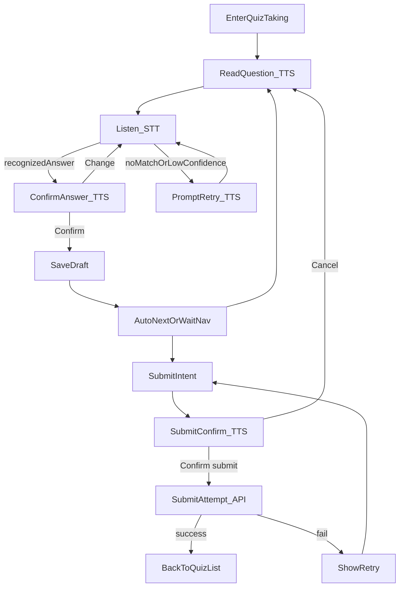

# 教育平台（学生端）Quiz 功能需求分析

> 版本：v1.0（面向学生端实现）  
> 语言约定：**界面按钮/提示文案为英文**（便于与现有 UI 统一）；需求说明为中文。  
> 无障碍重点：面向盲人学生，支持 **TTS 朗读 + STT 语音作答 + 原始音频留存回溯**。

---

## 1. 背景与目标

### 1.1 背景
学生端目前已有侧栏导航与主页信息。现需在学生端新增 `Quiz` 功能入口与完整作答/复盘流程。

### 1.2 目标
- 学生可以在 `Quiz` 页面看到**自己已选修课程**下需要完成的 Quiz，并按截止时间排序。
- 学生可以进入 Quiz 概览页确认开始作答，按“一次一题”的方式完成作答并提交。
- 学生可以查看已完成 Quiz 的结果：答对题数、逐题对照（作答/正确答案），简答题可查看教师评语。
- 盲人学生可在盲人模式下通过语音完成作答、确认/修改答案、语音提交；并支持教师端回放学生原始作答音频用于批改回溯。

### 1.3 范围（In scope）
- 学生端：Quiz 列表、概览、作答、提交、复盘。
- Quiz 题型固定：**5 道选择题（单选）+ 1 道简答题**。
- 无障碍：盲人模式（档案标记默认启用 + 手动开关兜底）、TTS/STT、原始音频录制与上传、结果页朗读教师评语。
- 基础错误处理与空状态。

### 1.4 非范围（Out of scope）
- 教师端完整创建/发布 Quiz 的 UI（**题目由教师端生成并推送**，此处只定义与学生端对接所需数据与回放能力的接口契约）。
- 多语言（当前仅英文语音交互与英文 UI 文案）。
- 分页与复杂筛选（不分页，不做课程筛选）。

---

## 2. 角色与权限

| 角色 | 能力 |
|---|---|
| Student | 查看自己选修课程的 Quiz；作答与提交；查看已完成 Quiz 的结果与教师评语；在盲人模式使用语音作答；对语音录音做知情同意 |
| Teacher（任课教师） | （教师端）可在线回放盲人学生作答原始音频；查看简答题文本转写与学生答案；填写评语 |
| Admin | 可在线回放盲人学生作答原始音频（审计用途）；查看回放审计日志 |

权限约束：
- Student **只能看到已选修课程**相关 Quiz。
- 音频回放：仅 **任课教师 + Admin** 可访问；**不允许下载**（仅在线播放）。

---

## 3. 信息架构与导航

### 3.1 侧栏新增入口
- Sidebar 新增一级菜单：`Quiz`

### 3.2 页面/路由（建议）
- `QuizList`：`/quiz`
- `QuizOverview`（未完成/已完成通用）：`/quiz/:quizId`
- `QuizTaking`：`/quiz/:quizId/take`
- `QuizReview`：`/quiz/:quizId/review`（已完成复盘）

> 注：最终路由以团队前端路由方案为准，但需保持页面职责一致。

---

## 4. 核心业务规则

### 4.1 Quiz 归属与可见性
- 每个 Quiz **只属于一门课程**。
- 学生端仅展示该学生**已选修课程**的 Quiz（= 需要完成的）。
- 列表仅展示“当前开放可作答”的未完成 Quiz（不展示未来未开始的 Quiz）。

### 4.2 列表排序
- 未完成 To Do：按 `DDL` **从近到远**升序排序。
- 已完成 Completed：建议按 `submittedAt` 降序（若无则按 `DDL`）。

### 4.3 状态标签（面向未完成卡片）
- **Not started**：学生尚未开始作答（无 attempt 或 attempt 未产生任何答案）。
- **In progress**：学生已开始作答但未提交（attempt 状态 draft）。
- **Due soon**：距离 DDL ≤ 24 小时（且未提交）。

### 4.4 提交流程
- 提交后自动跳转回 `QuizList`。
- 提交需要二次确认（防误触，尤其是语音提交）。

---

## 5. 数据对象与字段（学生端所需）

> 字段名仅为契约建议；类型为逻辑类型（实现可映射到 TS/JSON/DB）。  
> “必填”表示接口返回或提交时必须存在。

### 5.1 Quiz（测验）

| 字段名 | 类型 | 必填 | 说明 |
|---|---|---:|---|
| quizId | string | ✅ | Quiz 唯一标识 |
| title | string | ✅ | Quiz 标题 |
| courseId | string | ✅ | 课程 ID |
| courseName | string | ✅ | 课程名（用于列表卡片显示） |
| dueAt | datetime | ✅ | 截止时间（DDL，含时区） |
| questionCount | number | ✅ | 固定为 6 |
| mcqCount | number | ✅ | 固定为 5 |
| saCount | number | ✅ | 固定为 1 |
| visibility | enum | ✅ | 固定：available（学生端只拉可作答） |

### 5.2 Question（题目）

| 字段名 | 类型 | 必填 | 说明 |
|---|---|---:|---|
| questionId | string | ✅ | 题目 ID |
| quizId | string | ✅ | 所属 Quiz |
| order | number | ✅ | 1..6 |
| type | enum | ✅ | `MCQ_SINGLE` / `SHORT_ANSWER` |
| prompt | string | ✅ | 题干文本 |
| options | array | MCQ ✅ | 选择题选项数组（A-D） |
| options[].key | enum | MCQ ✅ | `A`/`B`/`C`/`D` |
| options[].text | string | MCQ ✅ | 选项文本 |

### 5.3 Attempt（作答记录）

| 字段名 | 类型 | 必填 | 说明 |
|---|---|---:|---|
| attemptId | string | ✅ | 本次作答记录 ID |
| quizId | string | ✅ | Quiz ID |
| studentId | string | ✅ | 学生 ID |
| status | enum | ✅ | `DRAFT` / `SUBMITTED` |
| startedAt | datetime | ✅ | 开始时间 |
| submittedAt | datetime | SUBMITTED ✅ | 提交时间 |
| lastSavedAt | datetime | ✅ | 最近保存时间（草稿） |

### 5.4 Answer（答案）

| 字段名 | 类型 | 必填 | 说明 |
|---|---|---:|---|
| attemptId | string | ✅ | attemptId |
| questionId | string | ✅ | questionId |
| type | enum | ✅ | 与题目一致 |
| mcqChoice | enum | MCQ ✅ | `A`/`B`/`C`/`D` |
| saText | string | SA ✅ | 简答题文本（含 STT 转写结果） |
| updatedAt | datetime | ✅ | 更新时间 |

### 5.5 Review（复盘数据：已完成 Quiz）

| 字段名 | 类型 | 必填 | 说明 |
|---|---|---:|---|
| attemptId | string | ✅ | attemptId |
| score | number | ✅ | 得分 |
| totalScore | number | ✅ | 总分 |
| mcqCorrect | number | ✅ | 选择题答对题数（0..5） |
| mcqTotal | number | ✅ | 固定 5 |
| items | array | ✅ | 逐题复盘条目 |
| items[].questionId | string | ✅ | 题目 ID |
| items[].order | number | ✅ | 题号 1..6 |
| items[].prompt | string | ✅ | 题干 |
| items[].type | enum | ✅ | 题型 |
| items[].myAnswer | object | ✅ | 学生作答（MCQ=choice，SA=text） |
| items[].correctAnswer | object | ✅ | 正确答案（MCQ=choice，SA=可为空或 rubric） |
| items[].isCorrect | boolean | MCQ ✅ | 选择题正误 |
| items[].teacherFeedback | string | SA 可选 | 教师评语（简答题） |

### 5.6 Audio（原始音频：盲人模式）

| 字段名 | 类型 | 必填 | 说明 |
|---|---|---:|---|
| audioId | string | ✅ | 音频 ID |
| attemptId | string | ✅ | attemptId |
| questionId | string | ✅ | questionId |
| studentId | string | ✅ | studentId |
| contentType | string | ✅ | 例如 `audio/webm` |
| durationMs | number | ✅ | 时长 |
| createdAt | datetime | ✅ | 创建时间 |
| storageKey | string | ✅ | 存储键（后端保存） |
| retentionUntil | datetime | ✅ | 到课程/学期结束自动删除时间 |

---

## 6. 页面需求（布局与按钮文案）

> 按钮/提示文案为英文；你可在实现时做 i18n 扩展，但当前以英文为准。

### 6.1 QuizList（列表页）

#### 6.1.1 布局
- 页面分为两块：`To Do (X)` 与 `Completed (Y)`，在**同一页面纵向排列**：
  - 上方为 `To Do (X)` 区块
  - 下方为 `Completed (Y)` 区块（中间可用分割线或留白区分）
- 每个 Quiz 使用卡片展示
- To Do 卡片显示：标题、课程、DDL、状态标签、预览按钮
- Completed 卡片显示：标题、课程、提交时间、得分/答对题数、预览按钮

#### 6.1.2 卡片字段与文案

| 元素 | 文案 / 格式 |
|---|---|
| 页标题 | `Quiz` |
| 副标题 | `Only quizzes from your enrolled courses are shown.` |
| 分区标题 | `To Do (X)` / `Completed (Y)` |
| 排序提示 | `Sorted by due date: soonest first` |
| To Do 卡片按钮 | `Preview` |
| Completed 卡片按钮 | `Preview result` |
| 状态标签 | `Not started` / `In progress` / `Due soon` |

#### 6.1.3 空/错状态
| 场景 | 文案 | 操作 |
|---|---|---|
| To Do 为空 | `No quizzes to do right now.` | 无 |
| Completed 为空 | `You haven't completed any quizzes yet.` | 无 |
| 加载失败 | `Failed to load quizzes. Please try again.` | `Retry` |

#### 6.1.4 页面纵向布局（To Do + Completed 同页）

- `QuizList` 页面上方为 `To Do (X)` 区块，下方为 `Completed (Y)` 区块。
- 两个区块都使用相同的卡片样式，仅展示字段不同（To Do 不展示得分；Completed 展示已提交时间与得分）。
- 卡片右下角提供按钮，点击按钮或整个卡片区域都会弹出对应的预览浮窗（未完成 = Quiz preview；已完成 = Quiz result），用户留在当前页面，不发生整页路由跳转。

---

### 6.2 QuizOverview（未完成：开始前概览）

> 说明：本小节描述的是「整页式概览」的早期方案，最终实现采用「浮窗预览」方式（见 6.3）。可保留此部分作为信息参考，但前端路由不再单独跳转 Overview 页面。

#### 6.2.1 布局
显示 Quiz 基本信息 + 无障碍开关 + 开始/返回按钮。

| 元素 | 文案 |
|---|---|
| 页标题 | `Quiz Overview` |
| 字段标签 | `Course:` `Due:` `Questions:` |
| 无障碍开关 | `Accessibility (Blind mode)` |
| 开关说明 | `Requires microphone. Voice will be recorded for grading review.` |
| 主按钮 | `Start quiz` |
| 次按钮 | `Back to list` |

#### 6.2.2 行为
- 若学生档案标记为盲人：开关默认 `On`。
- 允许学生手动切换 `On/Off`（兜底）。
- 切换为 `On` 时若未授权麦克风：弹出授权提示并说明录音留存与用途（见 7.1）。

---

### 6.3 浮窗预览布局（最终方案）

#### 6.3.1 未完成 Quiz 预览浮窗（Quiz preview）

- 触发方式：点击 To Do 卡片或按钮 `Preview`。
- 浮窗标题：`Quiz preview`
- 展示字段：
  - `Title`：Quiz 标题
  - `Course:` 课程名
  - `Due:` 截止时间（含时区）
  - `Status:` `Not started` / `In progress` / `Due soon`
  - `Questions:` `6 (5 MCQ + 1 Short answer)`
- 无障碍开关：
  - `Accessibility (Blind mode)`（逻辑同 7.1）
  - 说明文字：`Requires microphone. Voice will be recorded for grading review.`
- 底部按钮：
  - 次按钮：`Close`（关闭浮窗，留在列表页）
  - 主按钮：`Start quiz`（关闭浮窗并跳转到作答页 `QuizTaking`）
- 盲人模式下进入浮窗时，需 TTS 朗读摘要信息，并提示可以说 `Start` / `Close` 来操作（具体语音口令见无障碍章节）。

#### 6.3.2 已完成 Quiz 预览浮窗（Quiz result）

- 触发方式：点击 Completed 卡片或按钮 `Preview result`。
- 浮窗标题：`Quiz result`
- 展示字段：
  - `Title`：Quiz 标题
  - `Course:` 课程名
  - `Submitted:` 提交时间
  - `Correct:` `{mcqCorrect} / 5 (MCQ)`
  - `Score:` `{score} / {totalScore}`
  - `Short answer:` `Graded` / `Pending`
- 无障碍开关：
  - `Accessibility (Blind mode)`（控制在复盘页是否默认启用语音朗读）
- 底部按钮：
  - 次按钮：`Close`
  - 主按钮：`Review answers`（跳转到 `QuizReview`）
- 盲人模式下打开时，需 TTS 朗读成绩摘要，并支持语音口令：
  - `Review` → 跳转到复盘页
  - `Close` → 关闭浮窗
- 浮窗本身需键盘可达（焦点陷阱），关闭后焦点回到触发的卡片。

---

### 6.4 QuizTaking（作答页：一次一题）

#### 6.3.1 布局要点
- 顶部：Quiz 标题、课程、DDL、进度（`Qx/6`）
- 右上角：题号导航（1..6，标记已答）
- 中间：题面区域（题干 + 选项或简答输入）
- 底部：`Previous` / `Next`；最后一题显示 `Submit`
- 盲人模式下显示 Voice Panel（可聚焦、可键盘操作）

#### 6.3.2 按钮与文案
| 元素 | 文案 |
|---|---|
| 上一题 | `Previous` |
| 下一题 | `Next` |
| 提交 | `Submit` |
| 语音面板按钮 | `Repeat question` / `Stop reading` / `Help` |

#### 6.3.3 关键交互规则
- **自动跳题**：完成当前题并“确认”后自动进入下一题。
- **题号切换**：允许随时切换题号；切换前若有未确认答案，需先完成确认或放弃本次变更。
- **草稿保存**：每次答案确认后立即保存草稿（DRAFT）。

---

### 6.5 Submit Confirm（提交二次确认）

| 元素 | 文案 |
|---|---|
| 标题 | `Confirm submission` |
| 内容（示例） | `You are about to submit your quiz. You won't be able to change your answers after submission.` |
| 次要按钮 | `Cancel` |
| 主按钮 | `Confirm submit` |

提交成功提示：`Submitted successfully.` 并跳回 `QuizList`。  
提交失败提示：`Submission failed. Please try again.` + `Retry`（保留本地草稿与音频待上传队列）。

---

### 6.6 QuizOverview（已完成：结果概览）

| 元素 | 文案 |
|---|---|
| 页标题 | `Quiz Result Overview` |
| 字段标签 | `Submitted:` `Correct:` `Score:` |
| 主按钮 | `Review answers` |
| 次按钮 | `Back to list` |
| 无障碍开关 | `Accessibility (Blind mode)` |

---

### 6.7 QuizReview（复盘页：逐题对照）

#### 6.6.1 布局
整体结构与 `QuizTaking` 类似（顶部信息 + 题号导航 + 中间题面），差异：
- 每题展示：
  - `Your answer: ...` + 正误标签（MCQ）
  - `Correct answer: ...`
- 简答题额外展示：
  - `Your answer (text): ...`
  - `Teacher feedback: ...`

#### 6.6.2 文案
| 元素 | 文案 |
|---|---|
| 我的作答 | `Your answer:` |
| 正确答案 | `Correct answer:` |
| 教师评语 | `Teacher feedback:` |
| 返回概览 | `Back to overview` |
| 返回列表 | `Back to list` |

---

## 7. 无障碍（盲人模式）方案

### 7.1 进入/退出与知情同意
- 身份来源：学生档案标记（默认开启）。
- 兜底：在 Quiz 概览页提供开关，允许手动开启/关闭。
- 第一次开启盲人模式或首次进入 QuizTaking 时，弹窗说明：
  - 会使用麦克风进行语音识别与朗读控制
  - **会录制并保存原始音频**，用于教师批改回溯（保存至课程/学期结束）
  - 音频仅任课教师与管理员可在线播放回放，不可下载

建议弹窗文案（English）：
- Title：`Accessibility & recording notice`
- Body：`In Blind mode, your voice will be recorded and stored until the end of the term for grading review. Only the course teacher and administrators can replay it online. Downloads are disabled.`
- Buttons：`I agree` / `Cancel`

### 7.2 TTS 朗读规范（Review 也适用）
进入题目时建议朗读顺序：
1. `Question {n} of 6.`
2. 题干
3. 若 MCQ：`Options: A ... B ... C ... D ...`
4. 提示可用指令：`Say A, B, C, or D. Say 'Repeat' to hear again.`

朗读控制：
- 支持 `Repeat question`、`Stop reading`（立即中断）
- 长文本（简答题评语）分段朗读，每段后提示 `Continue/Stop`

### 7.3 STT 指令集（最小可用）
> 指令均为英文口令，便于与英文 TTS 对齐。

| 类别 | 指令 | 含义 |
|---|---|---|
| 作答（MCQ） | `A`/`B`/`C`/`D` | 选择选项 |
| 确认/修改 | `Confirm` / `Change` | 每题强制确认；修改重新作答 |
| 导航 | `Next` / `Previous` | 上/下一题 |
| 跳题 | `Go to question {n}` | 直接跳题 |
| 朗读控制 | `Repeat` / `Stop` | 重复/停止朗读 |
| 查看答案 | `My answer` | 读回当前题已保存答案 |
| 提交 | `Submit` | 触发提交确认 |
| 提交确认 | `Confirm submit` / `Cancel` | 二次确认提交 |
| 帮助 | `Help` | 朗读指令列表 |

### 7.4 每题强制确认（你要求的关键点）
#### 7.4.1 MCQ
1) 学生说出选项（A/B/C/D）  
2) 系统读回：`You chose B: {optionText}. Confirm? Say 'Confirm' or 'Change'.`  
3) `Confirm` 才保存并自动 `Next`；`Change` 重新选择

#### 7.4.2 Short answer（听写）
策略：分段听写 + 分段确认，降低长文本识别偏差。
- 进入题目：`Short answer. Dictation mode. Say your answer. Say 'End answer' when finished.`
- 每段识别后读回：`Added: '{text}'. Confirm? Say 'Confirm' or 'Change'.`
- 建议支持最小编辑口令：
  - `Undo`
  - `Delete last sentence`
  - `New line`
  - `End answer`

### 7.5 盲人模式状态机（语音确认态）

---

## 8. 原始音频录制、存储与回溯

### 8.1 录制范围
仅在 **盲人模式 On** 时录制原始音频，按题目粒度存档：
- MCQ：学生口述选项的音频片段
- Short answer：听写过程的音频（可按段或整题，建议按段便于重试与上传）

### 8.2 录制技术建议（前端）
- 录音：Web `MediaRecorder`
- 语音识别与朗读：Web Speech API（TTS + STT）

### 8.3 上传与一致性
建议策略：
- 录音片段先写入本地队列（内存/IndexedDB 视实现），获得 `audioLocalId`
- 答案确认后：先保存草稿答案，再异步上传对应音频（失败自动重试）
- 提交时：
  - 若仍有未上传音频：允许提交，但必须在后台继续上传并对失败做重试；同时后端应支持 “late audio attach” 到同一 attempt/question

### 8.4 生命周期（Retention）
音频保存至**课程/学期结束**自动删除：
- 由后端根据课程学期结束时间计算 `retentionUntil`
- 到期批量清理，并记录删除审计

### 8.5 回放权限与限制
| 项 | 要求 |
|---|---|
| 可回放角色 | 任课教师 + Admin |
| 学生可否回放 | 当前不要求（可后续扩展） |
| 是否可下载 | **不可下载**（仅在线播放） |
| 审计 | 回放必须记录：操作者、时间、音频ID、IP/设备信息（如可得） |

### 8.6 安全与合规建议
- 传输：HTTPS
- 存储：服务端加密存储（至少存储层加密）
- 最小化暴露：返回短时效签名播放 URL 或流式代理（避免直接暴露对象存储地址）

---

## 9. 接口契约（学生端最小集）

> 仅定义学生端需要的接口形状；最终实现可 REST/GraphQL。

| 接口 | 方法 | 说明 |
|---|---|---|
| `/api/quizzes/todo` | GET | 获取未完成且开放可作答的 Quiz 列表（已按 enroll 过滤） |
| `/api/quizzes/completed` | GET | 获取已完成 Quiz 列表（含 score/正确数摘要） |
| `/api/quizzes/{quizId}` | GET | 获取 Quiz 详情（题目、DDL、课程信息、是否盲人默认开启等） |
| `/api/attempts` | POST | 创建/获取 attempt（进入作答时） |
| `/api/attempts/{attemptId}/answers` | PUT | 保存草稿答案（单题或批量） |
| `/api/attempts/{attemptId}/submit` | POST | 提交 attempt |
| `/api/attempts/{attemptId}/review` | GET | 获取复盘数据（含正确答案与教师评语） |
| `/api/audio` | POST | 上传音频元数据与二进制（或分两步：先拿 uploadUrl 再 PUT） |

教师/管理员回放（仅契约点名）：
- `/api/audio/{audioId}/stream`：GET（鉴权后在线播放，不可下载；可通过响应头控制）
- `/api/audio/{audioId}/audit`：POST（服务端也可自动写审计）

---

## 10. 错误处理与降级

| 场景 | 处理 |
|---|---|
| Web Speech 不支持 | 盲人模式提示不支持，降级为键盘可达 + 屏幕阅读器友好（ARIA） |
| 麦克风权限被拒 | 显示提示与重试入口；允许继续使用非语音方式作答 |
| STT 识别失败 | 连续 3 次失败后提示键盘快捷键（如 `Alt+A/B/C/D`） |
| 录音失败/上传失败 | 保留答案草稿；音频进入重试队列；提示“Recording upload pending”但不阻塞作答 |
| 提交失败 | 保留草稿与待上传音频；允许重试提交 |

---

## 11. 验收标准（Acceptance Criteria）

### 11.1 列表与概览
- 侧栏出现 `Quiz` 入口，点击进入 `QuizList`。
- `QuizList` 仅展示学生已选修课程的 Quiz。
- To Do 按 DDL 升序排序；卡片显示课程名、DDL、状态标签（Not started/In progress/Due soon）。
- 未完成点击进入 `Quiz Overview`，可 `Start quiz` 或 `Back to list`。
- 已完成点击进入 `Quiz Result Overview`，展示 `Correct` 与 `Score`，可进入 `Review answers`。

### 11.2 作答流程
- Quiz 包含 6 题（5 MCQ + 1 SA），一次仅显示一题。
- MCQ 选择后必须确认才能自动进入下一题；可用题号切换。
- 最后一题可 `Submit`，弹出二次确认；提交成功返回列表页。

### 11.3 盲人模式（核心）
- 学生档案标记为盲人时，概览页盲人模式默认开启；且存在手动开关兜底。
- 开启盲人模式首次需明确告知：会录音并保存至学期结束，教师/Admin 可回放，不可下载。
- MCQ：系统朗读题干+选项；学生语音答 A/B/C/D；系统读回“字母+选项文本”并要求 Confirm/Change。
- SA：系统朗读题干；学生语音听写转文字；分段读回并确认；最终写入文本答案用于批改。
- 提交支持语音：`Submit` → 摘要朗读 → `Confirm submit` 才提交。

### 11.4 复盘与朗读
- 学生在复盘页逐题看到“我的作答/正确答案”；简答题看到教师评语。
- 盲人模式下复盘页可朗读：题干、我的作答、正确答案、教师评语（长评语分段读）。

### 11.5 音频留存与回溯
- 盲人模式下每题语音作答产生原始音频并成功上传关联到 attempt/question。
- 音频保留到课程/学期结束；仅教师/Admin 可在线播放回放；不可下载；回放有审计记录。

